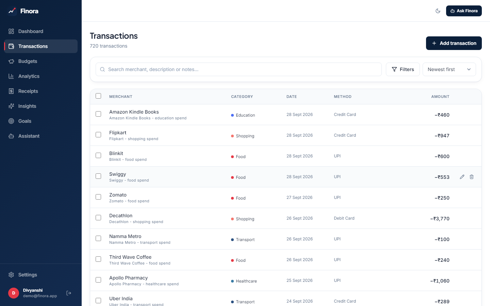
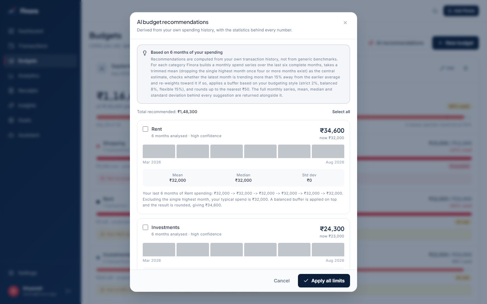
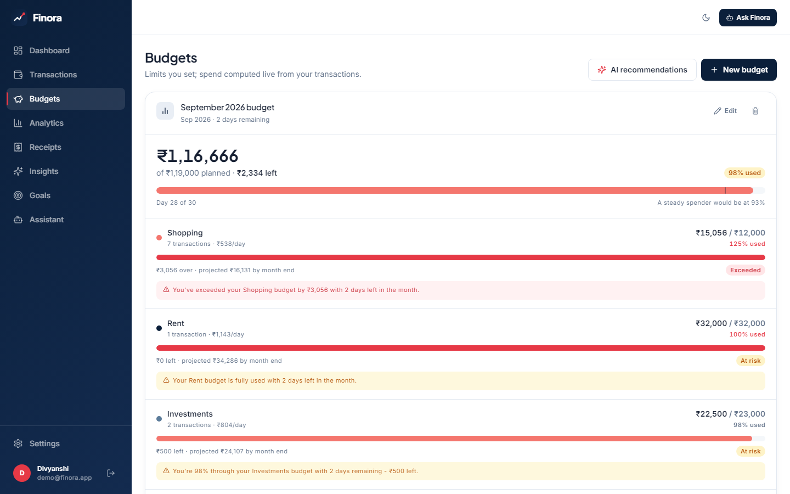
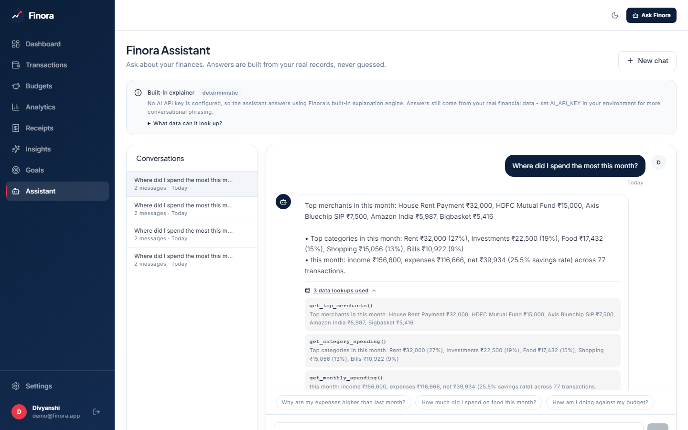
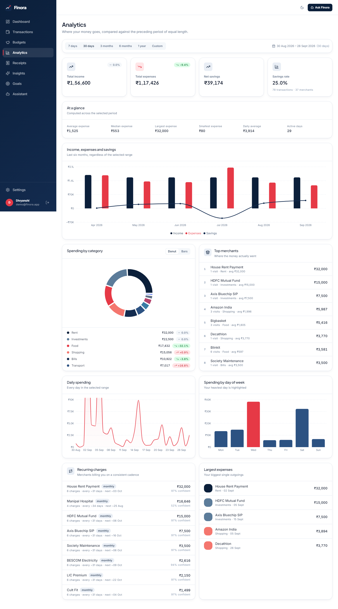
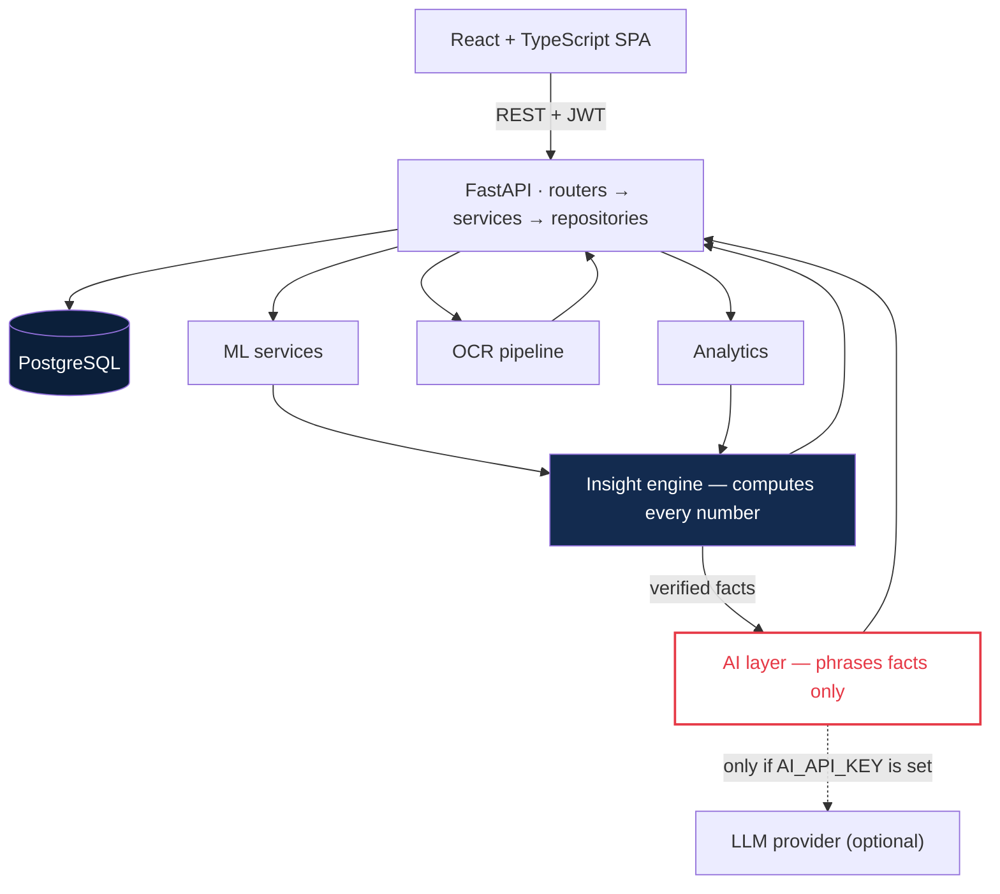

<div align="center">


# Finora

**An AI-powered personal finance platform.**
Track spending, budget from your own history, scan receipts, forecast cash flow,
and ask questions in plain English.


</div>

<!--
  CI badge — add once this is on GitHub. Replace OWNER/REPO and move the line
  into the badge block above. The workflow already exists:
  .github/workflows/ci.yml

  
-->

---


## Run it

```bash
cp .env.example .env
python -c "import secrets; print(secrets.token_urlsafe(48))"   # paste into JWT_SECRET
docker compose up --build
```

Open **http://localhost:5173** and sign in with `demo@finora.app` /
`FinoraDemo123!`

The demo account holds nine months of seeded data: ~720 transactions across
real Indian merchants, salary on the 1st, rent on the 2nd, fixed-day
subscriptions, a laptop purchase in July that the anomaly detector picks up,
and a budget that's close to being breached. API docs live at
**http://localhost:8000/api/docs**.

---

## What it does

### Transactions categorise themselves



Type a merchant and description and a trained classifier suggests the category
before you submit, with a confidence score and the tokens that drove it.
Override it and the correction becomes training data for the next model run.

The model is TF-IDF (word 1–2 grams + character 3–5 grams) into multinomial
Logistic Regression. The character n-grams matter more than you'd expect — real
bank narrations are full of `SWGGY`, `AMAZONIN` and `STARBUCKSCOFF`.

```console
$ python -m ml.predict "AMAZONIN prime video subscription"
category   : Entertainment
confidence : 88.10%

$ python -m ml.predict "AMAZONIN laptop sleeve order"
category   : Shopping
confidence : 34.53%     ← below the auto-apply threshold, so left for you to confirm
```

Same merchant, different category, decided by the description. Below 45%
confidence nothing is applied automatically — a wrong category silently
corrupts every budget and chart downstream.

**Measured on a held-out split** (`python -m ml.train` prints these; they are
never hand-written):

| accuracy | precision (macro) | recall (macro) | F1 (macro) | 5-fold CV F1 |
|---|---|---|---|---|
| 0.9568 | 0.9623 | 0.9616 | 0.9610 | 0.9557 ± 0.0114 |

<details>
<summary>Why the dataset is deliberately hard</summary>

<br>

The first version scored 100%, which was a red flag — every merchant mapped to
exactly one category, so the "classifier" was really a lookup table.

The committed dataset (1,848 rows; `python -m ml.build_dataset` regenerates it
byte-for-byte) now includes 12 genuinely ambiguous merchants — Amazon appears
under Shopping, Entertainment, Education and Food — plus ~22% garbled merchant
names, ~18% of rows with no merchant field at all, and ~40% raw narration with
no tidy description.

Errors now concentrate on exactly those ambiguous merchants, which is what a
real classifier looks like. CI verifies the committed CSV still matches its
generator, so the numbers above stay auditable.

It's a *demonstration* dataset: real merchant names, fictional transactions.
Bank statements are private data.

</details>

---

### Budgets recommend themselves from your history



Not generic benchmarks. For each category it takes six months of your spending,
drops the single highest month, checks whether the latest month is trending
away from the average, applies a buffer based on your budgeting style, and
rounds to a number a human would actually write down.

Every suggestion shows the monthly series, mean, median, standard deviation and
a written rationale:

> Your last 4 months of Food spending: ₹8,000 → ₹9,200 → ₹10,100 → ₹9,800.
> Excluding the single highest month, your typical spend is ₹9,000. A balanced
> buffer is applied on top and the result is rounded, giving **₹9,750**.

With under two months of history it declines and says so.



Spend is never stored — it's recomputed from transactions on every read, so it
can't drift. The marker on each bar shows where a steady spender would be by
this point in the month.

---

### The assistant looks things up before answering



This is the part worth reading the code for. Most "AI finance" features hand
your question to a language model and hope.

Finora decides which data the question needs, runs typed retrieval tools
against PostgreSQL, and only then asks a model to phrase the results. The
screenshot above has the tool trace expanded — you can see
`get_top_merchants()`, `get_category_spending()` and `get_monthly_spending()`
and exactly what each returned.

Thirteen tools cover spending, budgets, goals, forecasts, anomalies and period
comparison. Arithmetic happens in Python: ask *"how much could I save cutting
shopping by 20%?"* and the backend computes it. The model never multiplies
anything.

**No API key?** Each tool also returns a human-readable summary, so a built-in
explainer assembles the answer instead. The numbers are identical — only the
prose gets plainer, and the UI always says which mode produced the answer.

---

### Receipts, scanned properly


OpenCV preprocessing (grayscale → upscale → bilateral denoise → deskew →
adaptive threshold) into Tesseract, then a rule-based parser for merchant,
date, subtotal, tax, total and line items. Indian receipts split GST into CGST
and SGST on separate lines; the parser sums them.

Every field comes back with a confidence score, and nothing reaches your ledger
until you've checked it. Raw OCR text is kept so a parsing bug can be diagnosed
without asking you to re-upload.

It never fabricates a result. No Tesseract installed → a clear message and an
install hint, with the rest of the app unaffected. Unreadable photo → it says
so.

---

### Forecasting that admits what it doesn't know


The model is chosen by how much history exists — Holt-Winters with seasonality
at 24+ months, damped Holt's trend at 12+, simple exponential smoothing at 6+,
weighted moving average at 3+. Below three complete months it refuses to
forecast and explains why.

The band is an 80% prediction interval, not 95% — on a dozen monthly
observations a 95% band is so wide it tells you nothing. History is a solid
line and the forecast is dashed, because a projection should never look like a
measurement.

---

### Unusual spending, learned from you


Two detectors. A MAD-based modified z-score per category catches amounts that
are unusual *for that category* — median and median absolute deviation rather
than mean and standard deviation, because a single 50× transaction inflates the
standard deviation enough to hide itself. An Isolation Forest over six features
(amount, category-relative size, weekday, day of month, merchant familiarity,
recency gap) catches combinations that are individually unremarkable.

Flagging requires both to agree, which keeps false positives low. Every flag
carries its reasoning:

> ₹64,990 is 29.0× your typical Shopping transaction (median ₹2,238, usual
> range ₹725–₹3,860).

Mark something *expected* and it's never flagged again.

---

### Analytics and goals



Category, merchant, daily, weekday and monthly breakdowns, recurring-charge
detection, and comparison against the preceding period of equal length — so a
partial month is never compared against a complete one.


Goals keep a contribution ledger, suggest a monthly amount, and project a
completion date from your actual saving pace rather than an assumption.

---

### Dark mode


A designed theme rather than an inversion — the brand navy becomes the surface
colour and the accent red lifts to stay legible against it.

---

## Architecture



The organising rule: **the backend computes the facts, the AI explains them.**
The model has no database access, does no arithmetic, and receives only figures
that have already been computed. Remove the AI provider and the product still
works.

The frontend holds no secrets, runs no financial calculations and never touches
the database. Every repository helper takes a `user_id`, so there's no query
path that could return another user's rows.

| Layer | Stack |
|---|---|
| Frontend | React 18 · TypeScript · Vite · Tailwind · Recharts · Framer Motion |
| Backend | FastAPI · Pydantic v2 · SQLAlchemy 2.0 · Alembic |
| Database | PostgreSQL 16 — 13 tables, `Decimal` money, composite indexes |
| ML | scikit-learn · NumPy · pandas · statsmodels |
| OCR | Tesseract · OpenCV · Pillow |
| Auth | bcrypt · PyJWT |
| Infra | Docker Compose · nginx · GitHub Actions |

---

## Running locally

<details>
<summary><b>Without Docker</b></summary>

<br>

**Backend**

```bash
cd backend
python -m venv .venv && source .venv/bin/activate    # Windows: .venv\Scripts\activate
pip install -r requirements.txt
cp .env.example .env                                  # set DATABASE_URL and JWT_SECRET
```

PostgreSQL is the supported target:

```bash
createdb finora
python -m alembic upgrade head
```

Leave `DATABASE_URL` empty and it falls back to a local SQLite file instead — a
development convenience, logged loudly on startup. Docker and CI use
PostgreSQL.

Train the model (from the repository root), then seed and run:

```bash
cd .. && python -m ml.build_dataset && python -m ml.train && cd backend
python -m app.seed
uvicorn app.main:app --reload --port 8000
```

**Frontend**

```bash
cd frontend && npm install && npm run dev
```

Vite proxies `/api` to port 8000, so there's no CORS setup in development.

**Tesseract** (optional — receipts only)

`brew install tesseract` · `apt-get install tesseract-ocr` ·
[Windows installer](https://github.com/UB-Mannheim/tesseract/wiki) then set
`TESSERACT_CMD`. Already in the Docker image. Check it with
`curl localhost:8000/api/receipts/ocr-status`.

</details>

<details>
<summary><b>Environment variables</b></summary>

<br>

| Variable | Required | Purpose |
|---|---|---|
| `DATABASE_URL` | Yes (prod) | PostgreSQL connection. Empty → SQLite dev fallback. |
| `JWT_SECRET` | **Yes** | Token signing key. The app warns if left at its default. |
| `CORS_ORIGINS` | Yes | Allowed origins. Never `*` — the API is called with credentials. |
| `AI_PROVIDER` | No | `anthropic` · `openai` · `openai-compatible` |
| `AI_API_KEY` | No | Without it the built-in explainer is used. Figures are identical. |
| `AI_MODEL` · `AI_BASE_URL` | No | Model id and endpoint override. |
| `TESSERACT_CMD` · `OCR_LANGUAGES` | No | OCR binary path and languages. |
| `MAX_UPLOAD_MB` | No | Receipt size limit (default 8). |
| `ENVIRONMENT` · `LOG_LEVEL` | No | Runtime mode and log verbosity. |

Secrets are never committed, never logged (the log handler redacts
password/token/key patterns) and never exposed to the frontend.

</details>

<details>
<summary><b>ML commands</b></summary>

<br>

All run from the repository root:

```bash
python -m ml.build_dataset       # regenerate the seed CSV (deterministic)
python -m ml.train               # train, evaluate, persist + metrics JSON
python -m ml.evaluate            # score the persisted artefact (detects staleness)
python -m ml.predict "Swiggy order 450" --explain
```

Artefacts land in `ml/models/` and are gitignored — they're build outputs.

To retrain on your own corrections:

```bash
cd backend && PYTHONPATH=..:. python -m ml.export_corrections && cd ..
python -m ml.train
```

Settings → *Categorisation model* shows your acceptance rate and how many
corrections are waiting.

</details>

<details>
<summary><b>Screenshots</b></summary>

<br>

Every image in this README is a real capture of the running app:

```bash
cd frontend
npm install --no-save playwright && npx playwright install chromium   # one-off
npm run screenshots
```

It signs in as the demo user with Playwright, visits each view, waits for the
charts to settle, and writes to `docs/assets/screenshots/`. Nothing is mocked
or retouched.

</details>

---

## Testing

```bash
cd backend  && pytest                # 281 tests
cd frontend && npm test              # 36 tests
```

CI additionally runs typecheck, ESLint, Ruff (lint + format), the production
build, and applies the Alembic chain up → down → up against a real PostgreSQL.

Some of what's covered beyond the obvious CRUD:

- **Data isolation** — 10 tests proving user B can't read, update, delete or
  aggregate user A's transactions, budgets, goals, insights or conversations
- **Forged JWTs** signed with a different secret are rejected
- **Search safety** — SQL metacharacters in the search box are treated as
  literals; `ORDER BY` is whitelisted
- **Upload safety** — an executable renamed to `.png` with an image content
  type is rejected on magic bytes; filenames can't traverse paths
- **The worked budget example** — 8,000 → 9,200 → 10,100 → 9,800 must produce
  exactly ₹9,750
- **Model accuracy asserted within a 0.80–1.0 band** — a perfect score would
  mean the task is trivial, and the test fails
- **Provider outage fallback** — a broken LLM still yields the correct figures
- **Honest refusals** — forecasting below 3 months, anomaly detection below 12
  transactions, recommendations below 2 months

Four real bugs surfaced from these tests during development, including an OCR
amount regex that tokenised `1923.60` as `192` + `3.60` — turning a ₹1,923
total into ₹3.60.

---

## Security

bcrypt (cost 12) password hashing with SHA-256 pre-hashing for long
passphrases · JWT with `jti`/`iat`/`exp` · authorisation enforced in the
repository layer, with cross-user access returning 404 rather than 403 · login
runs a hash comparison even for unknown emails so timing doesn't leak · reset
tokens stored only as hashes, single-use, 30-minute expiry · Pydantic
validation on every endpoint with whitelisted sort fields · parameterised
queries throughout · magic-byte upload verification with server-generated
filenames · non-root container · CSP and security headers via nginx.

> Receipt images are stored unencrypted on the server filesystem. Don't upload
> documents more sensitive than you're comfortable processing on the machine
> running Finora.

---

## Disclaimer

**Finora provides educational financial insights based on data you enter. It is
not a substitute for professional financial, investment, tax or legal advice.**

The health score is an application-generated metric from a documented formula,
not a credit score. Forecasts are statistical projections of past behaviour,
not predictions — roughly one month in five is expected to fall outside the 80%
band. Anomaly flags mean "unusual for you", not "fraudulent". AI explanations
should be checked against the underlying figures, which the app shows alongside
every insight and answer.

---

## Roadmap

**Built:** authentication · transactions · ML categorisation with a feedback
loop · budgets and recommendations · receipt OCR · anomaly detection ·
forecasting · goals · health score · insight engine · AI assistant ·
light/dark themes · Docker · CI.

**Not built:** bank account integration · multi-currency · CSV import ·
recurring transaction automation · shared household budgets · native mobile
app · refresh tokens with revocation.

---

## Contributing

Fork, branch, and run everything before opening a PR:

```bash
cd backend && pytest
cd ../frontend && npm run typecheck && npm run lint && npm test && npm run build
cd .. && ruff check backend/app backend/tests ml && ruff format --check backend/app backend/tests ml
```

The rules that keep this project honest — these are the point, not style
preferences:

1. **No hardcoded financial values.** Every number a user sees is computed by
   the backend from the database.
2. **The AI never invents numbers.** New capabilities go through a retrieval
   tool. The model phrases; it doesn't calculate.
3. **Honest empty states.** If a feature can't produce a result, say so and
   explain what's needed. Never fabricate a placeholder.
4. **Every query is scoped by `user_id`,** with a test proving isolation.
5. **Schema changes ship with a migration** that applies *and* reverses.
6. **ML changes are reproducible** — rerun `build_dataset` and `train`, and
   quote metrics from that run.
7. **No fake buttons.** If it's in the UI, it works.

---

## License

[MIT](LICENSE)

<div align="center">
<br>

<br><br>
<sub>

Built by **Divyanshi** — [GitHub](https://github.com/Divyanshi12coder)

<i>Add your LinkedIn and portfolio links here when you have them.</i>

</sub>
</div>
